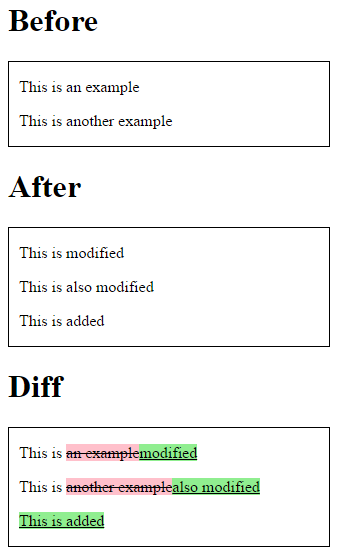

# Angular htmldiff

A simple angular wrapper for [htmldiff.js](https://github.com/tnwinc/htmldiff.js), which allows you to generate the diff between two pieces of html.

## Installation

    bower install angular-htmldiff --save
    npm install angular-htmldiff --save

## Output

An example output of a diff is shown below.



## Usage

**View**

Note that you can style the `ins` and `del` tags however you want.

```html
<!DOCTYPE html>
<html lang="en" data-ng-app="app" ng-controller="AppCtrl">
    <head>
        <meta charset="utf-8"/>
        <title>Angular htmldiff demo</title>
        <meta name="viewport" content="width=device-width, initial-scale=1">

        <script src="bower_components/angular/angular.js"></script>
        <script src="bower_components/angular-htmldiff/src/htmldiff.js"></script>
        <script src="bower_components/angular-htmldiff/src/angular-htmldiff.js"></script>

        <script src="app.js"></script>

        <style>
            .html-viewer {
                border: 1px solid black;
                padding: 0px 10px;
                width: 300px;
            }

            ins {
                background-color: lightgreen;
                padding: 3px;
            }

            del {
                background-color: pink;
                padding: 3px;
            }
        </style>
    </head>
    <body>
        <h1>Before</h1>
        <div class="html-viewer" id="before">
            <p>This is an example</p>
            <p>This is another example</p>
        </div>

        <h1>After</h1>
        <div class="html-viewer" id="after">
            <p>This is modified</p>
            <p>This is also modified</p>
            <p>This is added</p>
        </div>

        <h1>Diff</h1>
        <div class="html-viewer" ng-bind-html="diff"></div>
    </body>
</html>

```

**Controller**
```js
angular.module('app', ['htmldiff']);

angular.module('app').controller('AppCtrl', function($scope, $sce, htmldiff) {
    const before = angular.element(document.querySelector('#before'))[0].innerHTML;
    const after = angular.element(document.querySelector('#after'))[0].innerHTML;

    $scope.diff = $sce.trustAsHtml(htmldiff(before, after));
});
```
